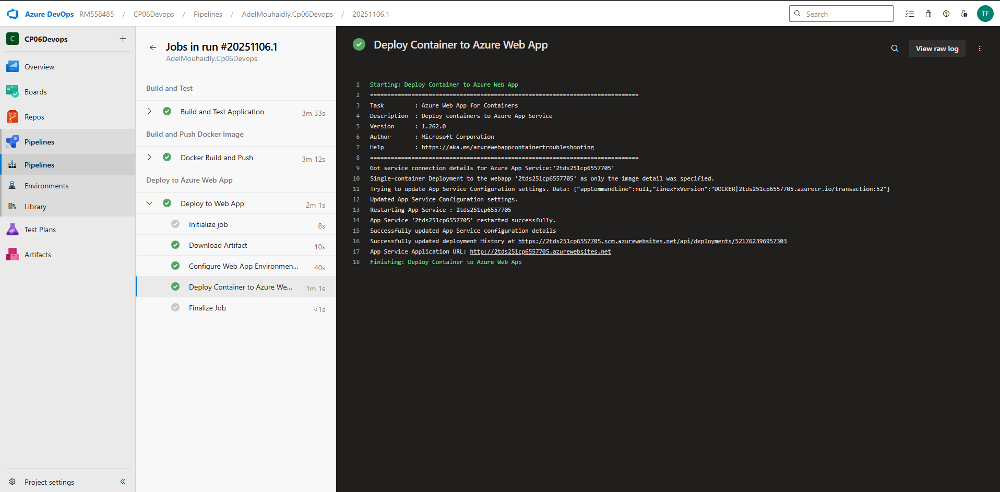
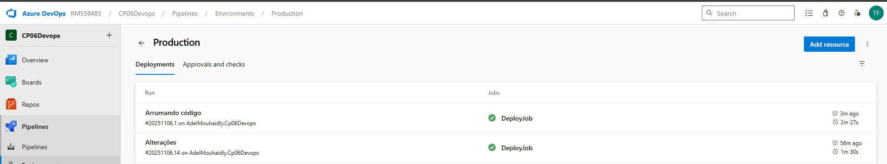
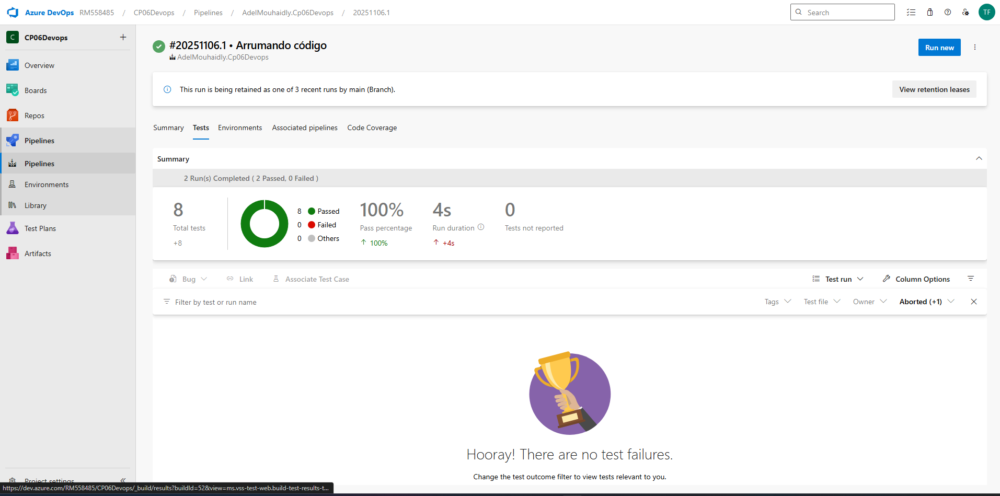
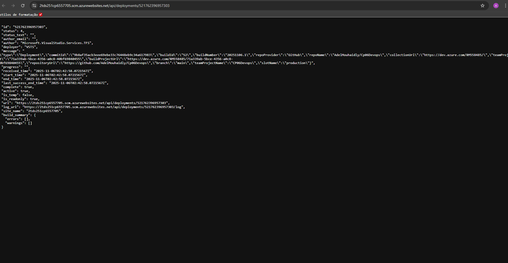
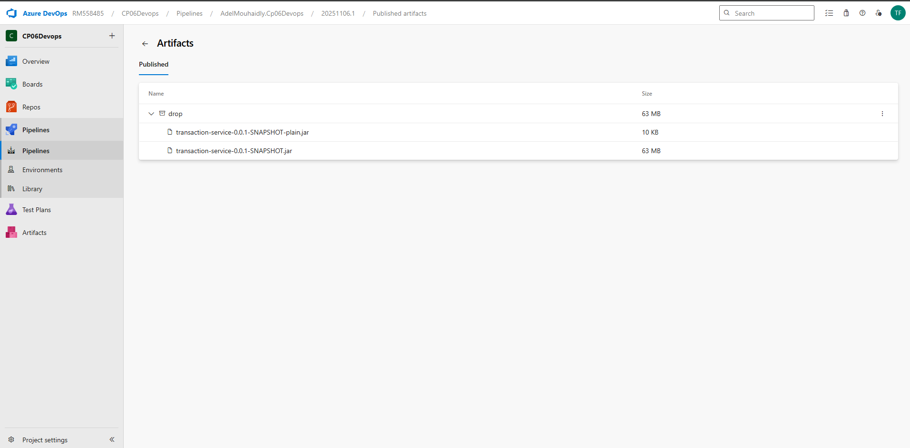
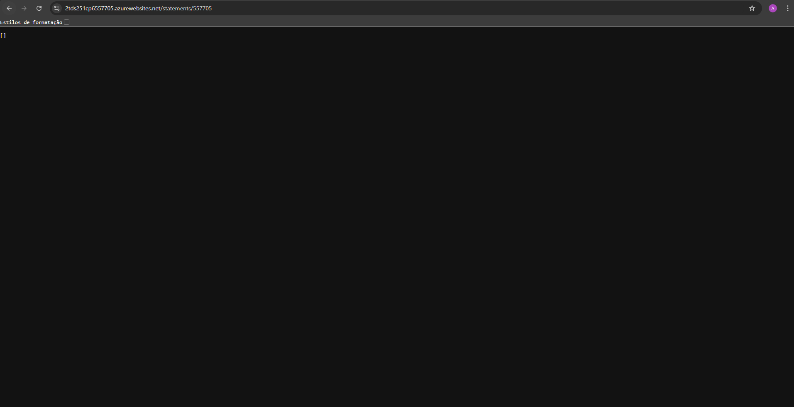

# CheckPoint 6: DevOps e CI/CD com Azure DevOps

## Integrantes

- **Afonso Correia Pereira** - RM557863 - 2TDSA
- **Adel Mouhaidly** - RM557705 - 2TDSA

---

## Links do Projeto

- **Azure DevOps**: [https://dev.azure.com/RM558485/CP06Devops](https://dev.azure.com/RM558485/CP06Devops)
- **WebApp (Aplicação)**: [https://2tds251cp6557705.azurewebsites.net](https://2tds251cp6557705.azurewebsites.net)

---

## Evidências

### 1. Pipeline Executando (Build e Testes)

_Descrição: Captura de tela do Azure DevOps mostrando a execução do pipeline com sucesso no stage Build. A imagem exibe o job "Build and Test Application" com todas as tasks executadas, incluindo a instalação do Java 21, compilação do código Kotlin com Gradle, execução dos testes automatizados e publicação dos resultados dos testes._

---

### 2. Imagem Docker no Azure Container Registry

_Descrição: Captura de tela do portal Azure mostrando o Azure Container Registry (ACR) com a imagem Docker `transaction` armazenada. A imagem exibe os detalhes da imagem incluindo as tags criadas (`latest` e o Build ID do pipeline), tamanho da imagem, data de criação e status do repositório._

---

### 3. Deploy no Azure Web App

_Descrição: Captura de tela do Azure DevOps mostrando o stage Deploy do pipeline executado com sucesso. A imagem exibe o job "Deploy to Web App" no ambiente Production, mostrando as tasks de configuração das variáveis de ambiente do WebApp (incluindo conexão com PostgreSQL) e o deploy do container Docker da imagem do ACR._

---

### 4. Aplicação Funcionando no WebApp

_Descrição: Captura de tela do navegador mostrando a aplicação transactions-services acessível e funcionando no Azure Web App. A imagem exibe a URL do WebApp (ex: `https://2tds251cp6557705.azurewebsites.net`), a resposta da API Spring Boot, status da aplicação e possíveis endpoints disponíveis através do Actuator ou respostas HTTP da API._

---

### 5. Logs do Pipeline Completo

_Descrição: Captura de tela do Azure DevOps mostrando o resumo completo da execução do pipeline com todos os stages. A imagem exibe a visão geral do pipeline com os três stages (Build, Docker, Deploy) todos marcados como concluídos com sucesso, incluindo tempos de execução, status de cada stage e a linha do tempo completa da execução do pipeline de CI/CD._

---

### 6. Resposta da API Funcionando

_Descrição: Captura de tela do navegador mostrando a resposta da API REST funcionando corretamente. A imagem exibe a requisição GET para o endpoint `/statements/{customerId}` com status HTTP 200 OK, retornando um JSON válido (array vazio `[]` quando não há dados ou lista de extratos bancários quando existem registros). A imagem demonstra que a aplicação está deployada, acessível e respondendo corretamente às requisições HTTP._

---

## Desafio

Você faz parte do time de tecnologia responsável pelo **Projeto DimDim**, do banco DimDim, uma instituição financeira nacional com mais de 1 milhão de correntistas. O banco está passando por uma transformação digital para se tornar mais ágil, moderno e competitivo, melhorando a experiência de seus clientes nos canais digitais e físicos.

Sua missão é atuar diretamente na aplicação **transactions-services**, responsável por:

- Processamento de transferências, TEDs, PIX, depósitos e saques
- Controle de extratos

O desafio é **automatizar o ciclo de vida da aplicação na nuvem**, utilizando Azure DevOps, garantindo que:

1. A aplicação seja **compilada e testada automaticamente** a cada alteração de código.
2. Uma **imagem Docker** seja gerada e enviada para o Azure Container Registry.
3. A aplicação esteja **deployada em um WebApp do Azure**, disponível e funcional para uso pelos clientes do banco.

> Esta não é uma avaliação de seguir passos: é um convite a **explorar, refletir e decidir** como resolver cada etapa do processo de DevOps, considerando o impacto real para a experiência do cliente e a operação diária da DimDim.

---

## Recursos Disponíveis

- Aplicação **transactions-services**, já _conteinerizada_, disponível neste repositório.
- Ambiente Azure (WebApp, Banco e ACR) pode ser criado via script: `scripts/setup.sh`.
- Ao término da atividade, é possível limpar o ambiente com o script: `scripts/cleanup.sh`.
- IA disponível para apoiar o aluno na construção da solução.
- Documentações oficiais do Azure, Docker e Gradle.

Use esses recursos como suporte para **planejar, testar e iterar** sua solução.

---

## Pontos de Reflexão

Antes de criar sua solução, considere:

- Como organizar o **pipeline** para que o Build, Test e Deploy funcionem de forma automatizada.
- Como garantir que a **imagem Docker** esteja sempre atualizada no registro.
- Quais variáveis, ambientes e configurações são necessárias para que o deploy funcione sem intervenção manual.
- Como você pode estruturar o YAML de forma **clara, eficiente e reprodutível**, refletindo boas práticas de DevOps.

---

## Critérios de Avaliação

Sua avaliação será baseada em:

- **Automação**: O pipeline realiza build, testes e deploy sem ações manuais.
- **Funcionalidade**: A aplicação está funcionando corretamente no WebApp após o deploy.
- **Gestão de imagens Docker**: A imagem é construída e enviada corretamente para o ACR.
- **Documentação e clareza**: O repositório contém informações suficientes para entender a pipeline e o deploy.
- **Reflexão e solução própria**: A forma como você organiza e resolve o desafio será considerada, valorizando **autonomia e criatividade**.

> Lembre-se: o aprendizado está no **processo de construir a solução**, refletir sobre as decisões e validar resultados.

---

## Dica de abordagem

- Experimente etapas isoladas antes de integrar tudo na pipeline.
- Leia os logs e mensagens da pipeline para entender falhas e acertos.
- Busque entender **por que** cada etapa é necessária, não apenas **como** fazê-la.
- Compartilhe aprendizados e problemas enfrentados; a avaliação também considera a capacidade de **analisar e aprender com o processo**.

---

## Observação importante

- Para que o deploy seja considerado válido, ele deve ser realizado **pelo pipeline**. Deploy manual não será aceito como solução correta.
- Inclua evidências da execução da pipeline (logs, prints do pipeline, logs do WebApp ou ACR) para comprovar que sua solução foi automatizada.
